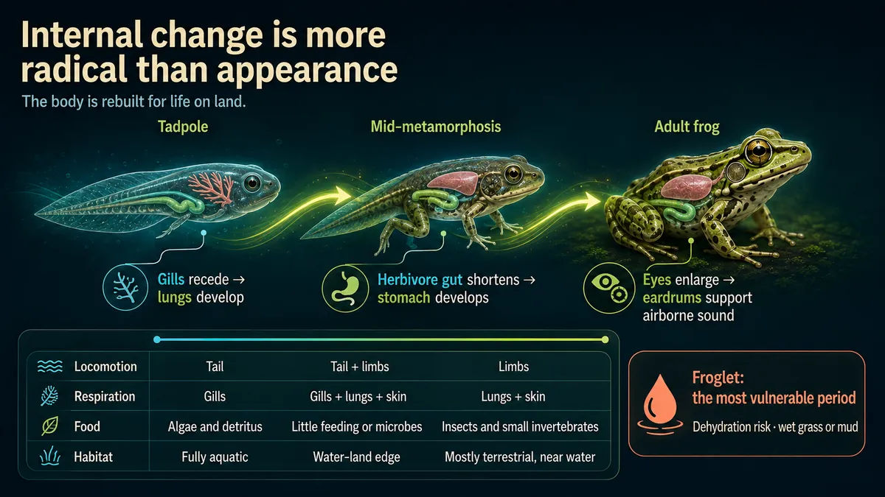
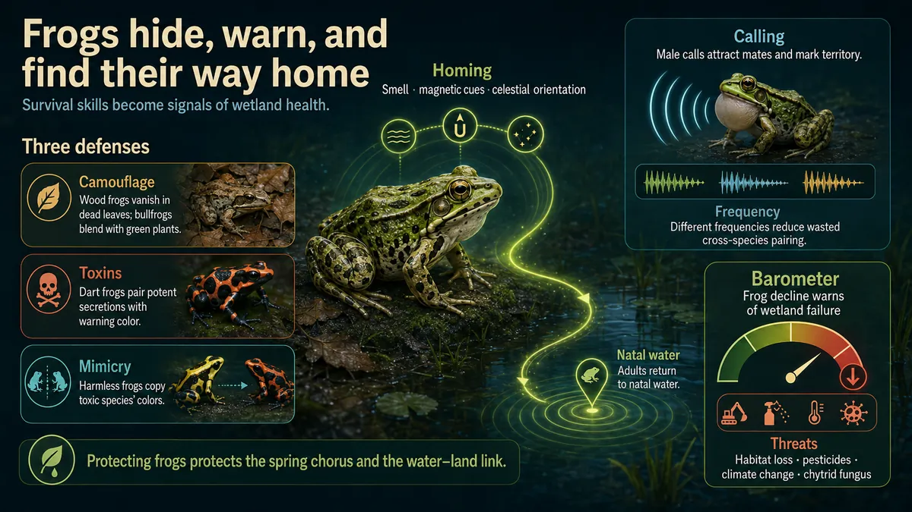

# Image PPTGen 3.0

<p align="center">
  <strong>Turn source material into a visually consistent, presentation-ready image deck.</strong><br>
  <sub>Image-first presentations, orchestrated by Codex.</sub>
</p>

<p align="center">
  
</p>

Image PPTGen 3.0 is the public product. It is not Image 1.0, 3.2, 5.0, or any
other historical route, and those versions are not supported alternatives.

## Start in one sentence

Send this one sentence to Codex:

> Install this Skill: https://image-pptgen.pages.dev/install.sh

After installation, give Codex your source material and ask it to create a
presentation. Image PPTGen 3.0 shows a page split first. You may revise that
split. Generation starts only after you explicitly confirm it.

> [!IMPORTANT]
> The installation request is only that sentence plus the address. Do not add a
> target directory, Python path, environment variable, or setup steps. The
> installer and Skill own location and configuration.

## How it works

```text
Install the Skill
    ↓
Submit text or Markdown material
    ↓
Review and revise the page split
    ↓
Explicitly confirm
    ↓
Generate
    ↓
Open the static Preview · Download the ZIP
```

Split review and generation are separate stages. Nothing is generated before
you confirm the split. Changing the page count does not require resubmitting
the source material.

The documented user journey stays: install, submit material, review or revise
the split, confirm, generate, open the static Preview, and download the ZIP.

## Demo: frog life cycle

These three images come from one Image 3.0 deck generated by the accepted
candidate. The source article was split, revised to four content pages plus a
fixed cover, then confirmed. The full Run is five pages; the gallery shows the
cover, a representative middle slide, and the final slide.

| Middle | Final |
| --- | --- |
|  |  |

The Demo uses the `public_image_3_0` / `codex_native_image` route. Images were
scaled in proportion for GitHub display and were not regenerated or retouched.
Full source identity and hashes are in [Demo provenance](docs/demo/PROVENANCE.md).

## Evaluation material

`eval-materials/` keeps source-controlled English samples used as an acceptance reference.
They are not a usage limit. Ordinary articles, notes, and reports are valid input.

## Good fits

- Turn an article, research note, or report into a visual presentation
- Review pagination before spending image-generation capacity
- Keep the deck visually consistent without maintaining a template by hand
- Deliver a static Preview and ZIP that do not depend on a long-running
  background service

## Supported platforms

| Platform | Architecture | Status |
| --- | --- | --- |
| macOS | ARM64 | Supported |
| Linux | x86_64 | Supported |

Windows is not a supported target. Do not present a Windows installation path.

## What you get

- A static Preview with page navigation, zoom, and full-screen viewing
- High-resolution PNG files in presentation order
- One ZIP containing the complete deck
- Traceable split, confirmation, and generation states

Generated presentation language follows the submitted material and the user's
request, including languages other than English.

## Frequently asked questions

<details>
<summary><strong>Where is it installed?</strong></summary>

The installer selects user-level directories for the current platform. Ordinary
users do not need to name those directories. Commands, the Skill, the runtime,
and state data are kept separate. Upgrades replace versioned program files
without overwriting generated content.

</details>

<details>
<summary><strong>Why must I confirm the page split first?</strong></summary>

Every presentation page is generated independently. Reviewing the structure
first lets you correct the page count, titles, and material boundaries before
consuming generation resources.

</details>

<details>
<summary><strong>Why is Preview static?</strong></summary>

The images, page data, and ZIP are prepared when generation completes. Preview
does not depend on a local service staying alive, which makes it easier to
archive or move across macOS ARM64 and Linux x86_64.

</details>

<details>
<summary><strong>Can I run the shell installer directly?</strong></summary>

The primary entry point is the Codex Skill. Advanced users may inspect and run
the installer themselves, but ordinary users do not need to copy a shell
pipeline.

</details>

## Source map

| Path | Responsibility |
| --- | --- |
| `skills/generate-image-presentation/` | Codex Skill: install follow-through, split confirmation, and generation flow |
| `packages/pptgen_toolkit/` | CLI client and static Preview bundling |
| `backend/` | Split, generation, state, audit, and artifact services |
| `frontend/` | Preview and local review interface source |
| `packaging/image/` | macOS ARM64 and Linux x86_64 adapters |
| `eval-materials/` | English acceptance samples, not a usage limit |

The Codex Skill is the user entry path. A browser web app is not the end-user
entry.
